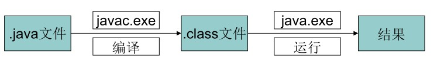

## 一、Java概述<!-- {docsify-ignore} -->

1991 年Sun公司的James Gosling等人开始开发名称为 Oak 的语言，希望用于控制嵌入在有线电视交换盒、PDA等的微处理器；

1994年将Oak语言更名为Java；

**Java的三种技术架构:**

* JAVAEE：Java Platform Enterprise Edition，开发企业环境下的应用程序，主要针对web程序开发；

* JAVASE：Java Platform Standard Edition，完成桌面应用程序的开发，是其它两者的基础；

* JAVAME：Java Platform Micro Edition，开发电子消费产品和嵌入式设备，如手机中的程序；

**JDK：Java Development Kit：**java的开发和运行环境，java的开发工具和jre。

**JRE：Java Runtime Environment**：java程序的运行环境，java运行的所需的类库+JVM(java虚拟机)。

**Java白皮书得关键术语:**

<table style="margin-left: auto; margin-right: auto;">
    <tr style="border: none;">
        <td style="border: none;">
            1）简单性 
            2）面向对象 
            3）分布式 
            4）健壮性 
            5）安全性 
            6）体系结构中立 
        </td>
        <td style="border: none;">
            7）可移植性 
            8）解释性 
            9）高性能 
            10）多线程 
            11）动态性  
        </td>
    </tr>
</table>
**javac命令和java命令**

java是分两部分的：一个是编译，一个是运行。

* javac：负责的是编译的部分，当执行javac时，会启动java的编译器程序。对指定扩展的java文件进行编译。生成了jvm可以识别的字节码文件。也就是class文件，也就是java的运序。

* java：负责运行的部分会启动jvm。加载运行时所需的类库，并对class文件进行执行。一个文件要被执行，必须要有一个执行的起始点，这个起始点就是main函数。