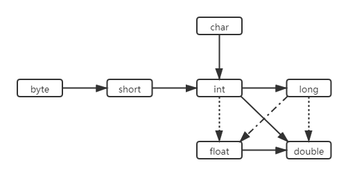
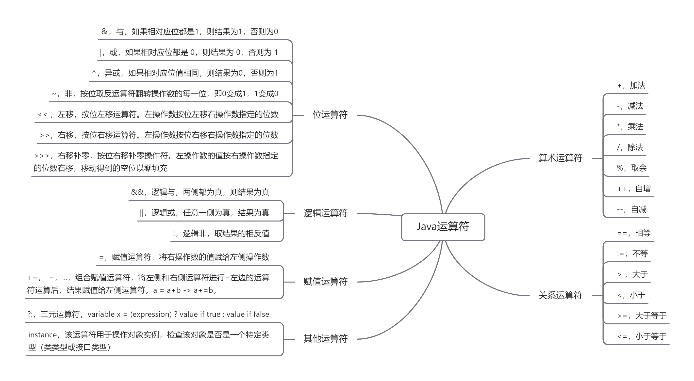
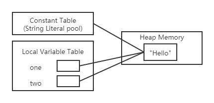
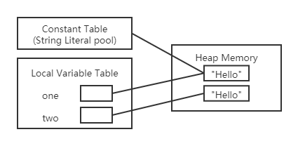
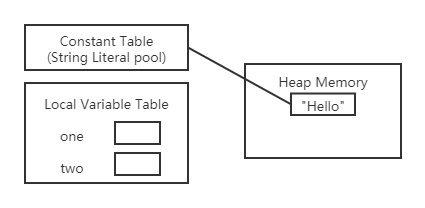
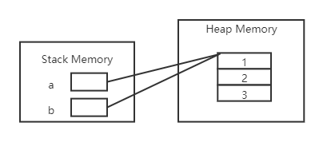

## 二、Java基础语法<!-- {docsify-ignore} -->

### 1.数据类型

#### 基本类型


> boolean 只有两个值：true、false，可以使用 1 bit 来存储，但是具体大小没有明确规定。JVM 会在编译时期将 boolean 类型的数据转换为 int，使用 1 来表示 true，0 表示 false。JVM 支持 boolean 数组，但是是通过读写 byte 数组来实现的。

#### 包装类型

基本类型都有对应的包装类型，基本类型与其对应的包装类型之间的赋值使用自动装箱与拆箱完成。

| 基本类型 | 包装类型  |
| -------- | --------- |
| byte     | Byte      |
| short    | Short     |
| int      | Integer   |
| long     | Long      |
| float    | Float     |
| double   | Double    |
| boolean  | Boolean   |
| char     | Character |

```java
Integer x = 2;     // 装箱 调用了 Integer.valueOf(2)
int y = x;         // 拆箱 调用了 X.intValue()
```

#### 类型转换

经常需要将一种数值类型转换为另一种数值类型。下图给出了数值类型之间的合法转换，实线表示无信息丢失的转换，虚线表示可能有精度丢失的转换。



#### 缓存池

new Integer(123) 与 Integer.valueOf(123) 的区别在于：

- new Integer(123) 每次都会新建一个对象；
- Integer.valueOf(123) 会使用缓存池中的对象，多次调用会取得同一个对象的引用。

```java
Integer x = new Integer(123);
Integer y = new Integer(123);
System.out.println(x == y);    // false
Integer z = Integer.valueOf(123);
Integer k = Integer.valueOf(123);
System.out.println(z == k);   // true
```

valueOf() 方法的实现比较简单，就是先判断值是否在缓存池中，如果在的话就直接返回缓存池的内容。

```java
public static Integer valueOf(int i) {
    if (i >= IntegerCache.low && i <= IntegerCache.high)
        return IntegerCache.cache[i + (-IntegerCache.low)];
    return new Integer(i);
}
```

在 Java 8 中，Integer 缓存池的大小默认为 -128~127。

```java
static final int low = -128;
static final int high;
static final Integer cache[];

static {
    // high value may be configured by property
    int h = 127;
    String integerCacheHighPropValue =
        sun.misc.VM.getSavedProperty("java.lang.Integer.IntegerCache.high");
    if (integerCacheHighPropValue != null) {
        try {
            int i = parseInt(integerCacheHighPropValue);
            i = Math.max(i, 127);
            // Maximum array size is Integer.MAX_VALUE
            h = Math.min(i, Integer.MAX_VALUE - (-low) -1);
        } catch( NumberFormatException nfe) {
            // If the property cannot be parsed into an int, ignore it.
        }
    }
    high = h;

    cache = new Integer[(high - low) + 1];
    int j = low;
    for(int k = 0; k < cache.length; k++)
        cache[k] = new Integer(j++);

    // range [-128, 127] must be interned (JLS7 5.1.7)
    assert IntegerCache.high >= 127;
}
```

编译器会在自动装箱过程调用 valueOf() 方法，因此多个值相同且值在缓存池范围内的 Integer 实例使用自动装箱来创建，那么就会引用相同的对象。

```java
Integer m = 123;
Integer n = 123;
System.out.println(m == n); // true
```

基本类型对应的缓冲池如下：

- boolean values true and false
- all byte values
- short values between -128 and 127
- int values between -128 and 127
- char in the range \u0000 to \u007F

在使用这些基本类型对应的包装类型时，如果该数值范围在缓冲池范围内，就可以直接使用缓冲池中的对象。

在 jdk 1.8 所有的数值类缓冲池中，Integer 的缓冲池 IntegerCache 很特殊，这个缓冲池的下界是 - 128，上界默认是 127，但是这个上界是可调的，在启动 jvm 的时候，通过 -XX:AutoBoxCacheMax=\<size> 来指定这个缓冲池的大小，该选项在 JVM 初始化的时候会设定一个名为 java.lang.IntegerCache.high 系统属性，然后 IntegerCache 初始化的时候就会读取该系统属性来决定上界。

### 2.Java运算符



### 3.控制流程

#### 条件语句

```java
// 基础结构
if(布尔表达式1){
	// 表达式1为真执行的语句
}else if(布尔表达式2){
	// 表达式2为真执行的语句
}else{
	// 上述表达式都不为真是执行的语句
}

// 条件语句可嵌套
if(true){
	if(true){
		// 嵌套demo
	}else{
        // 嵌套demo
    }
}
```

其中，else if 和 else分支是可选的，else if分支可以有多个，else分支只能有一个，也就是条件语句有`if(){}`，`if(){}else{}`，`if(){}else if(){}`，`if(){}else if(){}else{}`等不同形式。同时，条件语句是支持嵌套的。

#### switch case

```java
switch(expression){
    case value :
       //语句
       break; //可选
    case value :
       //语句
       break; //可选
    //你可以有任意数量的case语句
    default : //可选
       //语句
}
```

- switch 语句中的变量类型可以是： byte、short、int、char、String(JAVA 7之后)或者Enum。

- switch 不支持 long、float、double，是因为 switch 的设计初衷是对那些只有少数几个值的类型进行等值判断，如果值过于复杂，那么还是用 if 比较合适。

- switch 语句可以拥有多个 case 语句。每个 case 后面跟一个要比较的值和冒号。

- case 语句中的值的数据类型必须与变量的数据类型相同，而且只能是常量或者字面常量。

- 当变量的值与 case 语句的值相等时，那么 case 语句之后的语句开始执行，直到 break 语句出现才会跳出 switch 语句。case 语句不必须要包含 break 语句。如果没有 break 语句出现，程序会继续执行下一条 case 语句，直到出现 break 语句。

  ```java
  int i = 1;
  switch (i) {
      case 0:
          System.out.println("0");
          break;
      case 1:
          System.out.println("1");
          break;
      case 2:
          System.out.println("2");
          break;
      default:
          System.out.println("default");
  }
  // 输出结果 1
  
  int i = 1;
  switch (i) {
      case 0:
          System.out.println("0");
      case 1:
          System.out.println("1");
      case 2:
          System.out.println("2");
      default:
          System.out.println("default");
  }
  // 输出结果
  // 1
  // 2
  // default
  ```

- switch 语句可以包含一个 default 分支，该分支一般是 switch 语句的最后一个分支（可以在任何位置，但建议在最后一个）。default 在没有 case 语句的值和变量值相等的时候执行。default 分支不需要 break 语句。

#### 循环结构

* **while循环**

  ```java
  while( 布尔表达式 ) {
  	//循环内容
  }
  
  // 例子
  int x = 0;
  while( x < 10 ) {
      System.out.println("value of x : " + x );
      x++;
  }
  ```

  只要布尔表达式为 true，循环就会一直执行下去。

* **do…while循环**

  ```java
  do {
  	//代码语句
  }while(布尔表达式);
  
  // 例子
  int x = 10;
  do{
      System.out.println("value of x : " + x );
      x++;
  }while( x < 10 );
  ```

  对于 while 语句而言，如果不满足条件，则不能进入循环。但有时候我们需要即使不满足条件，也至少执行一次。

  do…while 循环和 while 循环相似，不同的是，do…while 循环至少会执行一次。

* **for循环**

  ```java
  for(初始化; 布尔表达式; 更新) {
      //代码语句
  }
  
  // 例子
  int sum = 0;
  for(int i = 1; i<=100; i++){
      sum = sum + i;
  }
  ```

  * 最先执行初始化步骤。可以声明一种类型，可初始化一个或多个循环控制变量，也可以是空语句。

  * 然后，检测布尔表达式的值。如果为 true，循环体被执行。如果为false，循环终止，开始执行循环体后面的语句。

  * 执行一次循环后，更新循环控制变量。

  * 再次检测布尔表达式。循环执行上面的过程。

* **增强for循环（Java5）**

  ```java
  for(声明语句 : 表达式){
     //代码语句
  }
  
  // 例子
  int [] numbers = {10, 20, 30, 40, 50};
  for(int n : numbers ){
      System.out.println( x );
  }
  ```

  声明语句：声明一个局部变量，该变量的类型必须和表达式的元素类型一致。

  表达式：表达式是要访问的数组名，或者返回值是数组的方法。

#### break&continue

* **break**

  break 主要用在循环语句或者 switch 语句中，用来跳出整个语句块。

  break 跳出最里层的循环，并且继续执行该循环下面的语句。

  ```java
  int i = 0;
  while(true){
      if(i==3){
          break;
      }
      i++;
  }
  // 当i=3时 跳出循环
  ```

* **continue**

  continue 适用于任何循环控制结构中。作用是让程序立刻跳转到下一次循环的迭代。

  在 for 循环中，continue 语句使程序立即跳转到更新语句。

  在 while 或者 do…while 循环中，程序立即跳转到布尔表达式的判断语句。

  ```java
  int sum = 0;
  for(int i = 1; i <= 100; i++){
  	if(i%2==0){
          continue;
      }
      sum = sum +i;
  }
  // 当i为偶数时不会执行 sum = sum + i 而是直接执行i++ 并进行下一次循环
  ```

### 4.String

#### 字符串字面量

让我们由一个简单的问题开始，什么是字符串字面量？一个字符串字面量就是两个双引号之间的字符序列，形如`"String"`、`"字面量"`。

#### 不可变字符串

Java的设计者认为共享带来的高效率远远胜过于提取、拼接字符串所带来的低效率。所以将String设计成不可变的。

String 被声明为 final，因此它不可被继承。(Integer 等包装类也不能被继承）

在 Java 8 中，String 内部使用 char 数组存储数据。

```java
public final class String
    implements java.io.Serializable, Comparable<String>, CharSequence {
    /** The value is used for character storage. */
    private final char value[];
}
```

在 Java 9 之后，String 类的实现改用 byte 数组存储字符串，同时使用 `coder` 来标识使用了哪种编码。

```java
public final class String
    implements java.io.Serializable, Comparable<String>, CharSequence {
    /** The value is used for character storage. */
    private final byte[] value;

    /** The identifier of the encoding used to encode the bytes in {@code value}. */
    private final byte coder;
}
```

value 数组被声明为 final，这意味着 value 数组初始化之后就不能再引用其它数组。并且 String 内部没有改变 value 数组的方法，因此可以保证 String 不可变。

**不可变的好处**

* **可以缓存 hash 值**

  因为 String 的 hash 值经常被使用，例如 String 用做 HashMap 的 key。不可变的特性可以使得 hash 值也不可变，因此只需要进行一次计算。

* **String Pool 的需要**

  如果一个 String 对象已经被创建过了，那么就会从 String Pool 中取得引用。只有 String 是不可变的，才可能使用 String Pool。

* **安全性**

  String 经常作为参数，String 不可变性可以保证参数不可变。例如在作为网络连接参数的情况下如果 String 是可变的，那么在网络连接过程中，String 被改变，改变 String 的那一方以为现在连接的是其它主机，而实际情况却不一定是。

* **线程安全**

  String 不可变性天生具备线程安全，可以在多个线程中安全地使用。

#### 检测字符串是否相等

可以使用字符串的`equals`方法来检测两个字符串是否相等，如果想要比较是否相等的同时忽略大小写可以使用`equalslgnoreCase`方法。

> 一定不要使用`==`运算符检测两个字符串是否相等！这个运算符作用在对象上比较的是引用是否相同。当然，如果字符串引用相同，它们必然相等。但是，完全有可能不同的引用相同内容的字符串。
>
> ```java
> String str = "Hello";
> System.out.println(str == "Hello"); // true
> System.out.println(str == new String("Hello")); // false
> System.out.println(str.substring(0,3) == "Hel"); // false
> ```
>
> 如果虚拟机始终将相同的字符串共享，就可以使用==运算符检测是否相等。但实际上只有字符串常量是共享的，而+或substring等操作产生的结果并不是共享的。因此，千万不要使用\==运算符测试字符串的相等性。

#### 空串与Null串

空串`""`是长度为0的字符串。可以调用以下代码检查一个字符串是否为空:

```java
if(str.length()==0) 或 if("".equals(str))
```

空串是一个Java对象，有自己的串长度（0）和内容（空）。不过，String变量还可以存放一个特殊的值，名为null，这表示目前没有任何对象与该变量关联，要检查一个字符串是否为null，要使用以下条件:

```java
if(str == null)
```

有时要检查一个字符串既不是null也不为空串，这种情况下就需要使用以下条件:

```java
if(str != null && str.length() != 0)
```

首先要检查str不为null。如果在一个null值上调用方法，会出现错误。

####  String, StringBuffer and StringBuilder

有些时候，需要由较短的字符串构建字符串。采用字符串连接的方式达到此目的效率比较低。每次连接字符串，都会构建一个新的String对象，既耗时，又浪费空间。使用 StringBuilder类就可以避免这个问题的发生。

```Java
// 首先构建一个StringBuilder
StringBuilder builder = new StringBuilder();
// 每次需要添加一部分内容时，就调用append方法
builder.append("xxx");
builder.append("xxx");
// 需要构建好的字符串，调用toString方法即可获得一个String对象
String result = builder.toString();
```

> 在JDK5.0中引入StringBulider类，这个类的前身是StringBuffer，StringBuffer效率相较StringBuilder较低，但是线程安全。

**可变性**

* String不可变
* StringBuffer 和 StringBuilder 可变

**线程安全**

- String 不可变，因此是线程安全的
- StringBuilder 不是线程安全的
- StringBuffer 是线程安全的，内部使用 synchronized 进行同步

#### String Pool

字符串常量池（String Pool）保存着所有字符串字面量（literal strings），这些字面量在编译时期就确定。不仅如此，还可以使用 String 的 intern() 方法在运行过程将字符串添加到 String Pool 中。

当一个字符串调用 intern() 方法时，如果 String Pool 中已经存在一个字符串和该字符串值相等（使用 equals() 方法进行确定），那么就会返回 String Pool 中字符串的引用；否则，就会在 String Pool 中添加一个新的字符串，并返回这个新字符串的引用。

> 当一个.java文件被编译成.class文件时，和所有其他常量一样，每个字符串字面量都通过一种特殊的方式被记录下来。
>
> 当一个.class文件被加载时（**注意加载发生在初始化之前**），JVM在.class文件中寻找字符串字面量。
>
> 当找到一个时，JVM会检查是否有相等的字符串在常量池中存放了堆中引用。
>
> **如果找不到，就会在堆中创建一个对象，然后将它的引用存放在池中的一个常量表中。**
>
> 一旦一个字符串对象的引用在常量池中被创建，这个字符串在程序中的所有字面量引用都会被常量池中已经存在的那个引用代替。

下面示例中，字符串常量池中只有一个引用，就是“Hello”这个字符串对象的引用。one和two都被赋予了同一个字符串对象的引用。

```java
String one = "Hello";
String two = "Hello";
System.out.println(one == two);	// true
```



下面这个示例中，one使用字符串字面量，two使用new关键字创建对象，当使用`new`创建对象时，JVM就会在运行时创建一个新对象，而不是使用常量池中的引用。

>使用`new String("Hello")`这种方式创建对象一共会创建两个字符串对象（前提是 String Pool 中还没有 "Hello" 字符串对象）。
>
>* "Hello" 属于字符串字面量，因此编译时期会在 String Pool 中创建一个字符串对象，指向这个 "Hello" 字符串字面量；
>* 而使用 new 的方式会在运行时在堆中创建一个字符串对象。

```java
String one = "Hello";
String two = new String("Hello");
System.out.println(one == two);	// false
System.out.println(one == two.intern());	//true
```



在 Java 7 之前，String Pool 被放在运行时常量池中，它属于永久代。而在 Java 7，String Pool 被移到堆中。这是因为永久代的空间有限，在大量使用字符串的场景下会导致 OutOfMemoryError 错误。

#### 垃圾回收

什么条件下对象才会被垃圾回收？当一个对象不再有引用指向它时，这个对象就会被回收。

下方例子中，在主函数结束前，有多少个对象可以被回收？0个？1个？还是2个？

```Java
public static void main(String[] args){
    String one = "someString";
    String two = new String("someString");
    one = two = null;
}
```

答案是1个，不像大多数对象，字符串字面量总是有一个来自字符串常量池的引用。

这就意味着它们会一直有一个引用，所以它们不会被垃圾回收。见下图，局部变量one和two没有指向字符串对象，但是仍然有一个字符串常量池的引用。

所以GC并不会回收这个对象。并且这个对象可以通过之前提到的intern()方法访问。



### 5.大数值

如果基本的整数和浮点数精度不能够满足需求，那么可以使用java.math包中的两个很有用的类: BigInteger和 BigDecimal。这两个类可以处理包含任意长度数字序列的数值。BigInteger类实现了任意精度的整数运算，BigDecimal实现了任意精度的浮点数运算。

使用静态的valueOf方法可以将普通的数值转换为大数值。

不能使用常见的算数运算符来处理大数值。而需要使用大数值类中的add，subtract等方法。下面列出常用的api。

#### BigInteger

* static BigInteger valueOf(long x); 将普通的数值转换为大数值。
* BigInteger  add(BigInteger  other); 加法。
* BigInteger  subtract(BigInteger  other); 减法。
* BigInteger  multiply(BigInteger  other); 乘法。
* BigInteger  divide(BigInteger  other); 除法。
* BigInteger  mod(BigInteger  other); 取余。
* int compareTo(BigInteger  other); 与other相比，小于返回负数，大于返回正数，相等返回0。

#### BigDecimal

* BigDecimal valueOf(long other); 将普通的数值转换为大数值。
* BigDecimal valueOf(long other, int scale);
* BigDecimal valueOf(Double other); 
* BigDecimal add(BigDecimal other); 加法
* BigDecimal subtract(BigDecimal other); 减法
* BigDecimal multiply(BigDecimal other); 乘法
* BigDecimal divide(BigDecimal other); 除法
* BigDecimal divide(BigDecimal other, int scale, RoundingMode roundingMode); 除法，scale设置保留位数，RoundingMode 设置舍入方式
* int compareTo(BigDecimal other); 与other相比，小于返回负数，大于返回正数，相等返回0。

### 6.数组

数组是一种数据结构，用来存储同一类型值的集合。通过一个整型下标可以访问数组中的每一个值。例如，如果a是一个整型数组，a[i]就是数组中下标为i的整数（数组的下标从0开始）。a.length就是数组的长度。

#### 数组初始化

* **静态初始化**

  开辟空间的同时，设置数组内容。

  ```java
  // 简化形式 数据类型 数组名称 = {值, 值,…}
  int[] data = {1,2,3};
  
  // 完成格式 数据类型 数组名称 = new 数据类型[] {值, 值,…}
  int[] data = new int[]{1,2,3};
  
  // 对于静态数组的初始化强烈建议使用完整语法模式，这样可以轻松地使用匿名数组这一概念。
  System.out.println(new int[] {1, 2, 3}.length);
  ```

* **动态初始化**

  先开辟空间，然后使用索引进行内容的设置。数组采用动态初始化开辟空间后，数组里面的每一个元素都是该数组对应数据类型的默认值。

  ```java
  int[] data = new int[3];
  data[0] = 0;
  data[1] = 1;
  data[2] = 2;
  
  int[] data = new int[3];
  for(int i = 0; i < data.length; i++){
      data[i] = i;
  }
  ```

#### 数组拷贝

在Java 中，允许将一个数组变量拷贝给另一个数组变量。这时，两个变量将引用同一个数组：

```java
int[] a = new int[]{1,2,3};
int[] b = a;
b[0] = 0;
System.out.println(a[0]); // 输出为0，因为b和a应用的是一个数组。
```



如果希望将一个数组的所有值拷贝到一个新的数组中去，就要使用Arrays类的copyOf方法：

```java
int[] b = Arrays.copyOf(a, a.length); // 第二个参数是新数组的长度。
```

#### 数组遍历

```java
int[] array = new int[]{1,2,3};
// for循环遍历
for(int i = 0; i < array.length; i++){
    System.out.println(a[i])
}
// 增强for循环遍历
for(int i : array){
    System.out.println(i)
}
```

#### 多维数组

多维数组可以看成是数组的数组，比如二维数组就是一个特殊的一维数组，其每一个元素都是一个一维数组。

* **静态初始化**

  ```java
  // 规则的二维数组
  int[][] a = new int[][]{{0,1},{2,3}};
  // 不规则的二维数组
  int[][] b = new int[][]{{0,1},{2,3,4}};
  ```

* **动态初始化**

  ```java
  // 声明一个2行2列的二维数组
  int[][] a = new int[2][2];
  a[0][0] = 1; // 给0，0位置的元素赋值
  int length = a[0].length; // 行的长度，也就是列数。
  
  // 可以分别为每一维分配空间
  int[][] s = new int[2][];
  s[0] = new int[2];
  s[1] = new int[3];
  s[0][0] = 1;
  s[1][2] = 2;
  ```

* **数组遍历**

  ```java
  int[][] a = new int[2][2];
  for (int i = 0; i < a.length; i++) {
      for (int j = 0; j < a[i].length; j++) {
          System.out.println(a[i][j]);
      }
  }
  ```

#### 数组的常见异常

* NullPointerException 空指针异常

  ```java
  // 数组是引用类型，如果引用类型没有指向任何对象，而访问了对象的属性或者调用了对象的方法就会报空指针异常
  int[] x = { 1, 2, 3 };
  x = null;
  System.out.println(x[1]);
  ```

* ArrayIndexOutOfBoundsException 索引值越界

  ```java
  // 当访问了不存在的索引值，就会报索引值越界异常
  int[] x = { 1, 2, 3 };
  System.out.println(x[3]);
  ```

#### Arrays 类

Arrays 类是一个工具类，其中包含了数组操作的很多方法。这个 Arrays 类里均为 static 修饰的方法（static 修饰的方法可以直接通过类名调用），可以直接通过 Arrays.xxx(xxx) 的形式调用方法。下面列出一些常用的方法。

* **int binarySearch(type[] a, type key)**

  使用二分法查询 key 元素值在 a 数组中出现的索引，如果 a 数组不包含 key 元素值，则返回负数。调用该方法时要求数组中元素己经按升序排列，这样才能得到正确结果。

* **int binarySearch(type[] a, int fromIndex, int toIndex, type key)**

  这个方法与前一个方法类似，但它只搜索 a 数组中 fromIndex 到 toIndex 索引的元素。调用该方法时要求数组中元素己经按升序排列，这样才能得到正确结果。

* **type[] copyOf(type[] original, int length)**

  这个方法将会把 original 数组复制成一个新数组，其中 length 是新数组的长度。如果 length 小于 original 数组的长度，则新数组就是原数组的前面 length 个元素，如果 length 大于 original 数组的长度，则新数组的前面元索就是原数组的所有元素，后面补充 0（数值类型）、false（布尔类型）或者 null（引用类型）。

* **type[] copyOfRange(type[] original, int from, int to)**

  这个方法与前面方法相似，但这个方法只复制 original 数组的 from 索引到 to 索引的元素。

* **boolean equals(type[] a, type[] a2)**

  如果 a 数组和 a2 数组的长度相等，而且 a 数组和 a2 数组的数组元素也一一相同，该方法将返回 true。

* **void fill(type[] a, type val)**

  该方法将会把 a 数组的所有元素都赋值为 val。

* **void fill(type[] a, int fromIndex, int toIndex, type val)**

  该方法与前一个方法的作用相同，区别只是该方法仅仅将 a 数组的 fromIndex 到 toIndex 索引的数组元素赋值为 val。

* **void sort(type[] a)**

  该方法对 a 数组的数组元素进行排序。

* **void sort(type[] a, int fromIndex, int toIndex)**

  该方法与前一个方法相似，区别是该方法仅仅对 fromIndex 到 toIndex 索引的元素进行排序。

* **String toString(type[] a)**

  该方法将一个数组转换成一个字符串。该方法按顺序把多个数组元素连缀在一起，多个数组元素使用英文逗号`,`和空格隔开。

