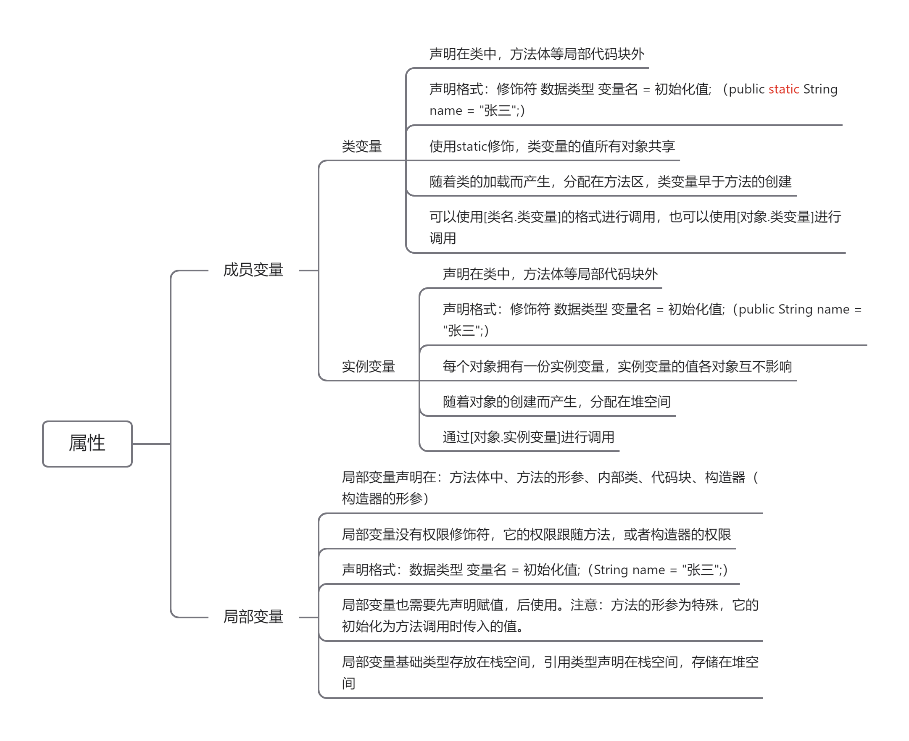

## 三、Java面向对象

### 1.面向对象简介

面向对象（Object Oriented）是一种新兴的程序设计方法，或者是一种新的程序设计规范(paradigm)，其基本思想是使用对象、类、继承、封装、多态等基本概念来进行程序设计。从现实世界中客观存在的事物（即对象）出发来构造软件系统，并且在系统构造中尽可能运用人类的自然思维方式。

#### 1.1.面向对象与面向过程

二者都是一种思想，面向对象是相对于面向过程而言的。

**面向过程：**强调的是功能行为，以函数为最小单位，考虑怎么做。

**面向对象：**将功能封装进对象，强调具备了功能的对象，以类/对象为最小单位，考虑谁来做。

#### 1.2.面向对象的特征

**封装：**保护内部的操作不被破坏。

**继承：**在原本的基础之上继续进行扩充。

**多态：**在一个指定的范围之内进行概念的转换。

#### 1.3.类与对象

**类**：是抽象的概念集合，表示的是一个共性的产物，类之中定义的是属性和行为（方法）。

**对象**：对象是一种个性的表示，表示一个独立的个体，每个对象拥有自己独立的属性，依靠属性来区分不同对象。

可以一句话来总结出类和对象的区别：类是对象的模板，对象是类的实例。类只有通过对象才可以使用，而在开发之中应该先产生类，之后再产生对象。类不能直接使用，对象是可以直接使用的。

### 2.类及类的成员

#### 2.1.属性（field）

##### 2.1.1.变量的分类

根据变量定义的位置不同，可以将变量分为成员变量，和局部变量两类，成员变量直接定义在类中方法等结构体外，局部变量定义在方法体中，代码块等中。成员变量又分为类变量和实例变量两类，区别在于使用static修饰的所有对象共享称为类变量，没有static修饰得为各对象独有的，成为实例变量。



```java
public class Demo {
    // 类变量
    public static String name = "张三";
    // 实例变量
    public Integer age = 18;

    public void method(){
        // 局部变量
        String name = "李四";
    }
}
```

##### 2.1.2.对属性的赋值操作

1. 默认初始化（基础类型初始值为对应类型的默认值，引用类型为null，未初始化数组为null，已初始化数组为其类型的默认值）
2. 显式初始化/代码块初始化（显式初始化和代码块初始化的顺序为声明的顺序，谁在前声明赋值，谁先赋值。）
3. 构造器初始化
4. 对象(类).属性/对象(类).方法，static修饰的可以用类名来调用。

```java
public class Demo {
	// 默认初始化示例 基本类型为该类型默认值，引用类型为null
    public static int default1;
    public static String default2;
	// 显式初始化示例
    public static String explicit1 = "显式初始化";
    // 代码块初始化示例
    public static String explicit2;
    static {
        explicit2 = "代码块初始化";
    }
	// 构造器初始化
    public static String constructor;
    public Demo() {
        constructor = "构造器初始化";
    }
    // 设置default1的值的静态方法
    public static void setDefault(int parm) {
        default1 = parm;
    }

    public static void main(String[] args) {
        System.out.println(default1); // 输出:0 因为int的默认值是0
        System.out.println(default2); // 输出:null 因为String的默认值是null
        System.out.println(explicit1); // 输出:显示初始化
        System.out.println(explicit2); // 输出:代码块初始化
        System.out.println(constructor); // 输出null，因为还没有创建过Demo的对象，构造器还没执行过
        
        new Demo();
        System.out.println(constructor); // 输出:构造器初始化

        Demo.default1 = 1;
        System.out.println(default1); // 输出:1，类变量可以通过类名.变量进行赋值

        Demo.setDefault(2);
        System.out.println(default1); // 输出:2，可以通过类名.方法来对变量进行赋值

    }
}
```

#### 2.2.方法

##### 2.2.1.方法的声明格式

方法的声明格式为：权限修饰符 其他修饰符 返回值类型 方法名（形参列表）{方法体}，如

```JAVA
public static void main(String[] args){
} 
```

* 权限修饰符：public，protected，default(不写的话默认是这个)，private；

* 其他修饰符：abstract，static，final

* 返回值类型：没有返回值为void，其他返回值为具体返回类型。

* 方法名：见名知意，符合java命名规范即可

* 形参列表：形参为局部变量，作用域在方法体内，赋值过程为调用参数传递过来的参数值。

  形参的格式为`,`隔开的变量，如`void method(Stirng a, int b)`，在Java5之后有一种特殊的形参，为可变参数形参。声明格式为在变量类型后边跟`...`，如`void method(String... args)`，可变参数的个数可以为0个、1个或多个，一个方法中只允许一个可变参数并且需要声明在形参声明的最后。

  ```java
  public static int method(String... args) {
      // 可变参数的使用方式和数组一致
  	return args.length;
  }
  public static void main(String[] args){
      // 调用方式
      // 0个参数
      method();
      // 1个参数
      method("1");
      // 多个参数
      int length = method("1","2","3");
      System.out.println(length); // 输出:3，是可变参数的长度
  } 
  ```
  
* 方法体：调用这个方法时要执行的逻辑，方法体内可以调用其他方法，和类的属性，但是不可以在定义新的方法。

##### 2.2.2.方法的调用

* **静态方法**

  属于类，可以通过[类名.方法名()]进行调用，方法体内可以调用其他静态的属性、静态的方法。

* **非静态方法**

  属于对象，可以通过[对象.方法名()]进行调用，方法体内可以调用其他属性、方法。

##### 2.2.3.方法的值传递

形参：形参指的是方法声明时的参数

实参：实参指的是方法调用时实际传给形参的参数值

* 形参是基本数据类型的值传递

  当基本数据类型作为参数传递时，传递的是实参值的副本，即传的是值，无论在函数中怎么操作这个副本，实参的值是不会被改变的。

  ```java
  public static void change(int age) {
      age = 18;
  }
  public static void main(String[] args) {
      int age = 8;
      System.out.println(age); // 输出:8
      change(age);
      System.out.println(age); // 输出:8
  }
  ```

* 形参是引用类型的值传递

  ```java
  public static void change(StringBuilder stringBuilder) {
      stringBuilder.append("World");
  }
  public static void main(String[] args) {
      StringBuilder sb = new StringBuilder("Hello,");
      System.out.println(sb.toString()); // 输出:Hello,
      change(sb);
      System.out.println(sb.toString()); // 输出:Hello,World
  }
  ```

  从上述例子输出结果来看，sb所指对象的值被改变了，那么是否可以说明当形参是引用类型时，传递的是该对象的引用呢？再来看下边的一个例子

  ```java
  public static void change(StringBuilder stringBuilder) {
      stringBuilder = new StringBuilder("Hi,World");
  }
  
  public static void main(String[] args) {
      StringBuilder sb = new StringBuilder("Hello,");
      System.out.println(sb.toString()); // 输出Hello,
      change(sb);
      System.out.println(sb.toString()); // 输出Hello,
  }
  ```

  可以看出，change函数并没有更改sb的值，这与传递的是该对象的引用是矛盾的。那么引用对象作为形参时传递的是什么呢？来画图分析下。

  在第一个例子中，调用change后，形参得到了一份源对象引用的拷贝，源对象引用与其拷贝指向同一个对象，所以当执行`stringBuilder.append("World")`时，源对象的值变成了"Hello,World"，而当change()方法结束时，stringBuilder局部变量消亡，sb的值为"Hello,World"。

  

  在第二个例子中，，调用change后，形参得到了一份源对象引用的拷贝，源对象引用与其拷贝指向同一个对象，而当执行`stringBuilder = new StringBuilder("Hi,World")`时，stringBuilder指向了新的对象，而sb的指向并没有变化，所以无论之后stringBuilder怎样修改都不会影响到sb，当调用change()结束后，stringBuilder局部变量消亡，sb的值还是为"Hello,"，并没有改变。

  

这个过程说明，Java程序设计语言对对象采用的不是按引用调用，实际上，对象引用是按值传递的（传递的是引用的一份拷贝）。所以，在java中，方法的参数传递只有一种，就是值传递。下面总结一下Java方法参数的使用情况：

* 一个方法不能修改一个基本数据类型的参数

* 一个方法可以改变一个对象参数的状态
* 一个方法不能让对象参数引用一个新的对象

##### 2.2.4.方法的重写与重载

* 重载

  定义：在同一个类中，允许存在一个以上的同名方法，只要它们的参数个数或者参数类型不同即可。

  注意：重载与返回值类型无关，判断重载只看参数列表是否不同。

  以下四个方法就是方法的重载，调用时根据传递参数的类型，个数来判断具体调用那个方法。

  ```java
  public static int add(int a, int b) {
      return a + b;
  }
  
  public static double add(int a, double b) {
      return a + b;
  }
  
  public static double add(double a, double b) {
      return a + b;
  }
  
  public static int add(int a, int b, int c) {
      return a + b + c;
  }
  ```

* 重写

  定义：在子类中可以根据需要对从父类中继承来的方法进行改造 也称为方法的重置、覆盖 。在程序执行时，子类的方法将覆盖父类的方法。

  要求：

  * 子类重写的方法必须和父类被重写的方法具有相同的方法名称、参数列表。
  * 子类重写的方法的返回值类型不能大于父类被重写的方法的返回值类型。
  * 子类重写的方法使用的访问权限不能小于父类被重写的方法的访问权限。子类不能重写父类中声明为 private 权限的方法。
  * 子类方法抛出的异常不能大于父类被重写方法的异常

  注意：子类与父类中同名同参数的方法必须同时声明为非static的（即为重写），或者同时声明为
  static的（不是重写）。因为static方法是属于类的，子类无法覆盖父类的方法。

  ```java
  public class Person {
      public String name;
      public Integer age;
  
      public String getInfo() {
          return "Name:" + this.name + ",Age:" + this.age;
      }
  }
  ```

  ```java
  public class Student extends Person {
      public String school;
      
  	// 重写父类的getInfo方法
      @Override
      public String getInfo() {
          return "Name:" + super.name 
              + ",Age:" + this.age 
              + ",School:" + this.school;
      }
  
      public static void main(String[] args) {
          // 同名的方法，用不同的对象来区分调用的是哪一个方法。
          Person person = new Person();
          person.name = "张三";
          person.age = 18;
          System.out.println(person.getInfo());
          // 输出:Name:张三,Age:18
          Person student1 = new Student();
          student1.name = "张三";
          student1.age = 18;
          System.out.println(student1.getInfo());
  		// 输出:Name:张三,Age:18,School:null
          Student student2 = new Student();
          student2.name = "张三";
          student2.age = 18;
          student2.school = "清华大学";
          System.out.println(student2.getInfo());
          // 输出:Name:张三,Age:18,School:清华大学
      }
  }
  ```

##### 2.2.5.方法的递归

递归方法是一种特殊的方法，这种方法会在方法体内调用自己。

方法的递归包含了一种隐式的循环，它会重复执行某段代码，但这种重复执行无须循环控制。递归一定要向已知方向递归，否则这种递归就变成了无穷递归，类似于死循环。

怎样设计一个递归方法：

1. 找整个递归的终止条件：递归应该在什么时候结束？
2. 找返回值：应该给上一级返回什么信息？
3. 本级递归应该做什么：在这一级递归中，应该完成什么任务？

题目：获取斐波那契数列的第n位数字，斐波那契数列是0、1、1、2、3、5、8、13、21、34...这样的一个数列，他的第n位（n>2）数字为前两项数字的和。前两位数字分别为0，1。

```markdown
1.递归的终止条件，首先想找到第n位数字，那就一定要有n-1和n-2位数字的值，而只有前两位的值是已知的，所以在n=1或n=2时可以终止递归。
2.找返回值，应该返回前两位数字相加的值
3.本级递归应该做什么，应该获取到前两位的值，并相加返回。
```

```java
public static long fn(int n) {
    if (n == 1) {
        return 0; // 递归终止条件
    }
    if (n == 2) {
        return 1; // 递归终止条件
    }
    return fn(n - 1) + fn(n - 2); // 此处产生递归，调用自己
}

public static void main(String[] args) {
    System.out.println(fn(5));
}
```

#### 2.3.构造器

##### 2.3.1.构造器的声明格式

格式：权限修饰符 类名（形参列表）{执行的内容}

```

```

##### 2.3.2.构造器的作用

#### 2.4.代码块

##### 2.4.1.静态代码块

##### 2.4.2.非静态代码块

#### 2.5.内部类

##### 2.5.1.成员内部类

##### 2.5.2.局部内部类

##### 2.5.3.匿名内部类

### 3.面向对象三大特征

#### 封装性

#### 继承性

#### 多态性

### 4.其他关键词

#### this

#### super

#### abstract

#### interface

#### static

#### final

#### extends

#### implements

#### instanceof

#### package

#### import

### 5.Object类的使用

