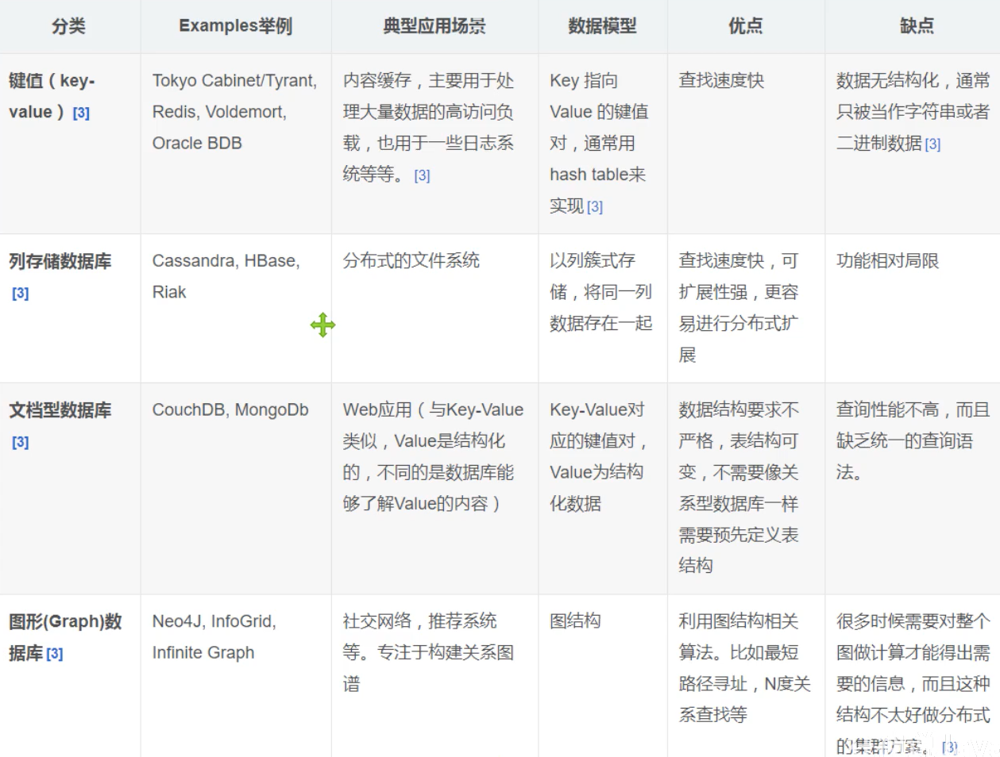

一些技术点

```bash
# 1.商品的基本信息
	名称、价格、商家信息
	关系型数据库就恶意解决了，MySQL/Oracle
	
# 2.商品的描述、评论（文字比较多）
	文档型数据库，MongoDB
	
# 3.图片
	- 分布式文件系统  FastDFS
	- 淘宝自己的     TFS
	- Geogle       GFS
	- Hadoop       HDFS
	- 阿里云        OSS
	
# 4.商品的关键字 （搜索）
	- 搜索引擎 solr elasticsearch
	- Iserach： （多隆）
	
# 5.商品热门的波段信息
	- 内存数据库
	- Redis	Tair Memache...

# 6.商品的交易，外部的支付接口
	- 三方应用
```

# NoSQL的四大分类

**KV键值对：**

* 新浪：redis
* 美团：redis+tair
* 阿里、百度：redis+memcache

**文档型数据库**

* MongoDB（一般必须要掌握）
  * MongoDB是一个基于分布式文件存储的数据库，c++编写，主要用来处理大量的文档！
  * MongoDB是一个介于关系型数据库和非关系型数据库中中间产品，MongoDB是非关系型数据库中功能最丰富，最像关系型数据库的。
* ConthDB

**列存储数据库**

* Hbase
* 分布式文件系统

**图型数据库**

* 他不是存图形，放的是关系，比如：朋友圈社交网络，广告推荐！
* Neo4j，InfoGrid



# Redis入门

## 概述

**redis能干嘛？**

* 内存存储、持久化，内存中是断电即失，所以持久化很重要（rdb，aof）
* 效率高，可以用于高速缓存
* 发布订阅系统
* 地图信息分析
* 计时器，计数器
* 。。。。

**特性**

* 多样的数据类型
* 持久化
* 集群
* 事务

## 安装

windows下解压即用，双击redis-server.exe启动redis

双击redis-cli.exe启动客户端

```
在客户端使用ping命令测试联通
使用set存值get取值
```

推荐使用linux开发

### linux下的redis安装

#### 正常安装

```bash
#安装gcc套装：
yum install cpp
yum install binutils
yum install glibc
yum install glibc-kernheaders
yum install glibc-common
yum install glibc-devel
yum install gcc
yum install make

#升级gcc
yum -y install centos-release-scl
yum -y install devtoolset-9-gcc devtoolset-9-gcc-c++ devtoolset-9-binutils
scl enable devtoolset-9 bash

#设置永久升级：
echo "source /opt/rh/devtoolset-9/enable" >>/etc/profile

#下载 redis安装包，或者本地上传
wget http://download.redis.io/releases/redis-6.0.7.tar.gz

#解压 选择在/usr/local目录下操作
tar -zxvf redis-6.0.7.tar.gz

#进入redis目录
cd redis-6.0.7

#编译
make

#安装 注意：PREFIX:指定安装目录（不存在会自动创建），安装完成会在安装目录下生成一个bin目录
make install PREFIX=/usr/local/redis install

#拷贝redis.conf到安装目录
cp redis.conf /usr/local/redis

#进入 /usr/local/redis目录
cd /usr/local/redis/

#编辑redis.conf  
vim redis.conf
	# 后台启动
	daemonize yes
	# 绑定端口，port 6379 默认是6379 需要安全组开放端口
	# 绑定IP，bind 127.0.0.1 可选具体配置具体改
	# 指定数据存放路径，dir /usr/local/redis/log rdb存放的路径
	# 指定持久化方式，appendonly no 是否开启aof
	# requirepass redis 设置密码

#后端启动redis：在redis安装目录下执行：
./bin/redis-server redis.conf

#查看是否启动成功：
ps aux | grep redis

#在redis安装目录下执行：
./bin/redis-cli --raw # 处理中文乱码问题

#关闭redis进程
./bin/redis-cli shutdown
kill -9 pid 进程

#登录
#方式一：
./redis-cli -h ip -p port
#方式二：
./redis-cli (不指定ip和端口默认会登录当前IP的默认端口（6379）)
#方式三：
./redis-cli -a myPassword
# 踩坑：如果redis服务已经启动、防火墙已经关闭或端口可以访问、安全组已经添加了端口，这时如果还是不能访问的话 需要将redis.conf配置文件中 注释 bind 127.0.0.1

#测试
登录后：
执行：set name zhangsan
执行：get name
如果两次都成功就算成功
```

#### 宝塔！！！傻瓜式安装

# Redis基础知识

redis默认有16个数据库默认使用的是第0个

可以使用select进行切换

```bash
SELECT 0
```

使用dbsize查看数据库大小

```bash
DBSIZE
```

查看所有的key

```bash
KEYS *
```

清空当前db

```bash
FLUSHDB
```

清空所有库

```bash
FLUSHALL
```

判断某个键是否存在

```
EXISTS name
```

移动某个键到指定数据库

```
MOVE name 1
```

删除某个键

```
DEL name
```

设置过期时间

```bash
EXPIRE name 10 #秒数
```

看某个键还有多久过期

```
TTL name
```

查看某个键的类型

```
TYPE name
```

## 五大数据类型

### String（字符串）

向某个键的内容追加，如果不存在则新建

```
APPEND key1 "hello"
```

获取字符串的长度

```
STRLEN key1
```

自增操作

```bash
INCR key1
INCRBY key1 10 #步长为10
```

自减操作

```bash
DECR views
DECRBY key1 10 #步长为10
```

截取字符串

```bash
GETRANGE key1 0 3 #闭区间
GETRANGE key1 0 -1 #截取所有
```

替换字符串

```bash
SETRANGE key1 1 xxxx #从那个位置修改为xxxx
```

setex（set with expire）设置过期时间

```
setex key1 30
```

setnx（set if not exist）不存在在设置(在分布式锁中常使用)

```
setnx key1 "redis"
```

批量设置

```
mset k1 v1 k2 v2 k3 v3
```

批量获取

```
mget k1 k2 k3
```

msetnx(原子性操作，要么一起成功要么一起失败)

```
msetnx k1 v1 k4 v4
```

设置对象

```bash
set user:1 {name:zhangsan,age:30} #设置一个user：1对象，值为json来保存一个对象
mset user:1:name zhangsan user:1:age 30 #另一种写法
mget user:1:name user:1:age
```

getset 先get在set

```bash
getset db redis #如果不存在之返回null如果存在值先返回原值在设置新值
```

String类的使用场景：value除了是我们的字符串还可以是我们的数字

* 计数器
* 统计多单位的数量

### List

所有的list命令都是l开头的

往列表中存值

```bash
LPUSH list one #将一个值或多个值插入到列表头部（左）
LPUSH list two
LPUSH list three
RPUSH list rigth #将一个值或多个值插入到列表尾部（右）
```

取值

```
LRANGE list 0 -1
```

移除一个值

```
LPOP list
RPOP list
```

获取指定下标的值

```
LINDEX list 1
```

获取列表长度

```
LLEN list
```

移除指定的值

```bash
LREM list 1 one #移除list集合中指定的value 0全部删除，1删除一个2删除两个
```

trim截取区间 这个list已经改变了

```
ltrim list 1 2 # 只要1到2的值闭区间
```

rpoplpush移除第一个列表的最后一个元素，添加到第二个列表中

```
rpoplpush list1 list2 
```

更新值

```bash
lset list 0 item # 需要列表和下标存在
```

插入一个值

```
linsert list before "world" "other"
linsert list after "world" "other"
```

### set

set开头都是set

插入值

```bash
sadd myset "hello"
sadd myset "world"
```

查看值

```
smembers myset
```

判断某个值是否存在

```
sismember myset hello
```

查看set有几个元素

```
scard myset
```

移除set中的值

```
srem myset hello
```

随机从set中抽取一个元素

```bash
SRANDMEMBER myset
```

随机删除一个set的key

```
spop myset
```

将一个指定的值，移动到另一个set中

```
smove myset myset2 "hello"
```

差集

```
SDIFF myset1 myset2
```

交集

```
SINTER myset1 myset2
```

并集

```
SUNION myset1 myset2
```

### Hash（哈希）

Key-Map，套娃

存值

```
hset myhash field1 lve
```

取值

```
hget myhash field1
```

批量存

```
hmset myhash field1 hello fleld2 world
```

批量获取

```
hmget myhash field1 field2
```

获取全部

```
hgetall myhash
```

删除hash指定key字段

```
hdel myhash field1
```

获取长度

```
hlen myhash
```

判断某个键是否存在

```
hexists myhash field1
```

获取所有的字段

```
hkeys myhash
```

获取所有的值

```
hvals myhash
```

给某个键自增

```
hincrby myhash field3 1
```

给某个键自减

```
hdecrby myhash field3 1
```

hash应用，变更的数据，更适合存对象

```
hset user:1 name lve
hget user:1 name
```

### Zset（有序集合）

在set的基础上增加了一个值， set k1 v1 -->zset k1 score v1 中间的值类似权重可以排序

添加值

```bash
zadd myset 1 one # 添加一个值
zadd myset 2 two 3 three # 添加多个值
```

排序实现

```bash
zadd salary 2500 xiaohong 5000 zhangsan 500 kuangshen
zrangebyscore salary -inf +inf # 从负无穷到正无穷 升序
zrangebyscore salary -inf +inf withscores # 带上score一起显示
zrangebyscore salary -inf 2500 withscores #从负无穷到2500
zrevrangebyscore salary +inf -inf 降序
```

移除某个值

```
zrem salary xiaohong
```

查看长度

```
zcard salary
```

查看某区间的值有几个

```
zcount myset 1 3
```

## 三种特殊数据类型

geospatial 地理位置

朋友的定位，附近的人，打车距离计算

geoadd 添加地理位置

```
geoadd china:city 116.40 39.90 beijing
geoadd china:city 121.47 31.23 shanghai
```

geopos获取经度和纬度

```
geopos china:city beijing
```

返回两个指定位置的距离

```
geodist china:city beijing shanghai km
```

georadius 以给定的经纬度为中心，找出某一半径内的元素

```bash
georadius china:city 110 30 1000 km
georadius china:city 110 30 1000 km withdist withcoord count 1 # 一些可选参数
```

georadiusbymember 以给定的经纬度为中心，找出某一半径内的元素

```
georadius china:city 北京 1000 km
```

geo数据是用的zset作为底层使用的

### Hyperloglog

基数：不重复元素的个数

A{1，3，5，7，8，7} B{1，3，5，7，8} 基数=5

应用：统计网页的UV （一个人访问多次，但还是算作一个人）0.81%错误率！

优点：占用的内存是固定的，2^64不同元素的基数，只需要废12kb内存

传统方式，set保存用户的id，然后就可以统计set中的元素数量做标准判断。

这个方式如果保存大量的用户id就会比较麻烦，我们的目的是为了计数，而不是保存用户的id

```bash
pfadd mykey a b c d e f g h i j # 添加元素
pfcount mykey # 统计基数
pfadd mykey2 i j z x c v b n m
pfmerge mykey3 mykey mykey2 # 合并
```

做访问量统计，如果允许容错，一定可以使用Hyperloglog

如果不允许容错，就是用set或者自己的数据类型即可

### Bitmaps

位存储

统计用户信息，活跃，不活跃，登录，未登录，打卡，未打卡，两个状态的都可以使用Bitmaps

```bash
# 统计一周打卡天数 0未打卡
setbit sign 0 1
setbit sign 1 1
setbit sign 2 0
setbit sign 3 1
setbit sign 4 0
setbit sign 5 1
setbit sign 6 0
# 查看某天是否打卡
getbit sign 6
# 统计打卡天数
bitcount sign 
bitcount sign 3 6 #可选参数 从x到x
```

# 事务

redis单条命令是保存原子性的，但是事务不保证原子性

Redis的事务是没有隔离级别的概念

所有的命令在事务中，并没有直接被执行！只有发起执行命令的时候才会执行

Redis事务本质：一组命令的集合！一个事务中的所有命令都会被序列化，在事务执行过程中，会按照顺序执行！

一次性、顺序性、排他性！执行一系列的命令

```
------队列 set set set 执行-------
```

redis事务

* 开启事务（multi）
* 命令入队（）
* 执行事务（exec）

```bash
# 正常执行事务
multi # 开启事务
# 命令入队
set k1 v1
set k2 v2
get k2
set k3 v3
exec #执行事务
```

* 放弃事务（discard）

```bash
multi # 开启事务
# 命令入队
set k1 v1
set k2 v2
get k2
set k3 v3
discard # 放弃事务 事务中的命令都不会被执行
```

编译型异常（代码有问题！命令有错），事务中所有的命令都不会执行

运行时异常（1/0），如果事务中存在语法性错误，那么执行命令的时候，其他命令是可以正常执行的，错误命令抛出异常。

* 监控  Watch

  **悲观锁：**很悲观，认为什么时候都会出问题，无论做什么都加锁

  **乐观锁：**很乐观，认为什么时候都不会出现问题，所以不会上锁，更新数据的时候去判断一下，在此期间是否有人修改过这个数据，获取version，更新的时候比较version。

```bash
set money 100
set out 0
watch money # 监视money对象
multi # 事务正常结束，数据期间没有发生变动，这个时候就正常执行成功，如果执行期间money被改动，事务提交失败
decrby money 20
incrby out 20
exec

# 如果事务失败 先用unwatch解锁，在开事务重新执行
```

使用watch可以当作redis的乐观锁操作

# Jedis

```java
Jedis jedis = new Jedis("ip", port);
jedis.auth("密码");
System.out.println(jedis.ping());
```

api命令和上边一致

**事务**

```java
Jedis jedis = new Jedis("49.234.75.113", 6379);
jedis.auth("ly.19980430");

JSONObject jsonObject = JSONUtil.createObj();
jsonObject.put("hello", "world");
jsonObject.put("name", "lve");
//开启事务
Transaction multi = jedis.multi();
String result = jsonObject.toString();

try {
	multi.set("user1",result);
	multi.set("user2",result);
	//执行事务
	multi.exec();
} catch (Exception e) {
	//放弃事务
	multi.discard();
	e.printStackTrace();
} finally {
	System.out.println(jedis.get("user1"));
	System.out.println(jedis.get("user2"));
	//关闭链接
	jedis.close();
}
```

# SpringBoot整合

SpringBoot操作数据：spring-data jpa jdbc mongodb redis

SpringData也是和SpringBoot齐名的项目

在SpringBoot2.x之后，原来使用的jedis被替换为了lettuce

* jedis：采用的直连，多个线程操作的话，是不安全的，如果想要避免不安全的，需要使用jedis pool连接池，BIO
* lettuce：采用的netty，示例可以在多个线程中共享，不存在线程不安全的情况，可以减少线程的数据，NIO

**导入依赖**

```xml
<dependency>
	<groupId>org.springframework.boot</groupId>
	<artifactId>spring-boot-starter-data-redis</artifactId>
</dependency>
```

**添加配置**

```yaml
spring:
  redis:
    host: 127.0.0.1
    port: 6379
    database: 1 # 使用那个数据库
    password: *** # 密码
```

**测试**

```java
	@Autowired
    RedisTemplate redisTemplate;

    @Test
    void contextLoads() {
        //redisTemplate 操作不同的数据类型，api和客户端指令是一致的
        //opsForValue 操作字符串，opsForList 操作list。。。
        //常用操作提出来了，可以直接redisTemplate去操作，比如事务和基本的crud
        //获取redis的链接对象，不常用
        //RedisConnection connection = redisTemplate.getConnectionFactory().getConnection();
        //connection.flushAll();
        //connection.flushDb();
        //关于对象的存储，都需要序列化
        redisTemplate.opsForValue().set("mykey", "lve");
        System.out.println(redisTemplate.opsForValue().get("mykey"));
    }
```

**自定义redistemplate**（公司的，狂神的在文件夹代码中）自定义redisutil（也在代码里）

```java
@Slf4j
@Configuration
@EnableCaching
public class RedisCacheAutoConfiguration {

    /**
     * 重新配置一个RedisTemplate
     *
     * @param redisConnectionFactory
     * @return
     */
    @Primary
    @Bean
    @ConditionalOnMissingBean(name = "redisTemplate")
    public RedisTemplate redisTemplate(RedisConnectionFactory redisConnectionFactory) {
        RedisTemplate template = new RedisTemplate();
        template.setConnectionFactory(redisConnectionFactory);
        Jackson2JsonRedisSerializer jackson2JsonRedisSerializer = new Jackson2JsonRedisSerializer(Object.class);
        ObjectMapper om = new ObjectMapper();
        om.setVisibility(PropertyAccessor.ALL, JsonAutoDetect.Visibility.ANY);
        om.enableDefaultTyping(ObjectMapper.DefaultTyping.NON_FINAL);
        jackson2JsonRedisSerializer.setObjectMapper(om);
        RedisSerializer<String> stringSerializer = new StringRedisSerializer();
        // key采用String的序列化方式
        template.setKeySerializer(stringSerializer);
        // hash的key也采用String的序列化方式
        template.setHashKeySerializer(stringSerializer);
        // value序列化方式采用jackson
        template.setValueSerializer(jackson2JsonRedisSerializer);
        // hash的value序列化方式采用jackson
        template.setHashValueSerializer(jackson2JsonRedisSerializer);
        template.setDefaultSerializer(jackson2JsonRedisSerializer);
        return template;
    }

    /**
     * 配置缓存管理器
     *
     * @param redisConnectionFactory
     * @return
     */
    @Bean
    public CacheManager cacheManager(RedisConnectionFactory redisConnectionFactory) {
        RedisSerializer<String> stringSerializer = new StringRedisSerializer();
        Jackson2JsonRedisSerializer jackson2JsonRedisSerializer = new Jackson2JsonRedisSerializer(Object.class);
        ObjectMapper om = new ObjectMapper();
        om.setVisibility(PropertyAccessor.ALL, JsonAutoDetect.Visibility.ANY);
        om.enableDefaultTyping(ObjectMapper.DefaultTyping.NON_FINAL);
        jackson2JsonRedisSerializer.setObjectMapper(om);
        // 生成一个默认配置，通过config对象即可对缓存进行自定义配置
        RedisCacheConfiguration redisCacheConfiguration = RedisCacheConfiguration.defaultCacheConfig();
        // 设置缓存的默认过期时间，也是使用Duration设置
        redisCacheConfiguration = redisCacheConfiguration
                // 设置缓存有效期一小时
                .entryTtl(Duration.ofHours(24))
                .serializeKeysWith(RedisSerializationContext.SerializationPair.fromSerializer(stringSerializer))
                .serializeValuesWith(RedisSerializationContext.SerializationPair.fromSerializer(jackson2JsonRedisSerializer));

        return RedisCacheManager
                .builder(RedisCacheWriter.nonLockingRedisCacheWriter(redisConnectionFactory))
                .cacheDefaults(redisCacheConfiguration)
                .build();
    }

    @Bean
    @ConditionalOnMissingBean(RedisUtils.class)
    @ConditionalOnBean(name = "redisTemplate")
    public RedisUtils redisUtils(RedisTemplate redisTemplate) {
        RedisUtils redisUtils = new RedisUtils(redisTemplate);
        log.info("RedisUtils [{}]", redisUtils);
        return redisUtils;
    }
}
```

# Redis.conf详解

## 单位

```bash
# Redis configuration file example.
requirepass 123456 # 宝塔的配置
maxclients 10000 # 宝塔的配置
#
# Note that in order to read the configuration file, Redis must be
# started with the file path as first argument:
#
# ./redis-server /path/to/redis.conf

# Note on units: when memory size is needed, it is possible to specify
# it in the usual form of 1k 5GB 4M and so forth:
#
# 1k => 1000 bytes
# 1kb => 1024 bytes
# 1m => 1000000 bytes
# 1mb => 1024*1024 bytes
# 1g => 1000000000 bytes
# 1gb => 1024*1024*1024 bytes
#
# units are case insensitive so 1GB 1Gb 1gB are all the same.
```

配置文件，大小写不敏感

## 包含

```bash
################################## INCLUDES ###################################

# Include one or more other config files here.  This is useful if you
# have a standard template that goes to all Redis servers but also need
# to customize a few per-server settings.  Include files can include
# other files, so use this wisely.
#
# Notice option "include" won't be rewritten by command "CONFIG REWRITE"
# from admin or Redis Sentinel. Since Redis always uses the last processed
# line as value of a configuration directive, you'd better put includes
# at the beginning of this file to avoid overwriting config change at runtime.
#
# If instead you are interested in using includes to override configuration
# options, it is better to use include as the last line.
#
# include /path/to/local.conf
# include /path/to/other.conf
```

可以把多个配置文件包含进来

## 网络

```bash
################################## NETWORK #####################################
~~~
bind 127.0.0.1 # 绑定的ip 如果外网访问改为0.0.0.0
protected-mode yes #受保护的模式
port 6379 # 端口
```

## 通用

```bash
################################# GENERAL #####################################
daemonize yes # 以守护进程运行，是否后台运行，默认是no
pidfile /www/server/redis/redis.pid #如果以后台方式运行，我们就需要制定一个pid文件
loglevel notice #日志级别
logfile "/www/server/redis/redis.log" # 日志文件位置，为空就是默认输出
database 16 # 数据库的数量，默认是16
always-show-logo yes # 显示不显示logo，控制台的呢个字符拼接logo
```

## 快照

持久化，再规定的时间内，执行了多少次操作，则会持久化到文件.rdb .aof

redis是内存数据库，如果没有持久化，那么断电即失

```bash
################################ SNAPSHOTTING  ################################
save 900 1 # 如果900s内，如果至少有1个key进行了修改，我们进行持久化操作
save 300 10 # 如果300s内，如果至少10个key进行了修改，我们进行持久化操作
save 60 10000 # 如果60s内，如果至少10000个key进行了修改，我们进行持久化操作
stop-writes-on-bgsave-error yes # 持久化如果出错，是否还需要继续工作
rdbcompression yes # 是否压缩rdb文件，需要消耗一些cpu资源
rdbchecksum yes # 保存rdb文件的时候，进行错误的校验
dir /www/server/redis/ # rdb文件保存目录
```

## 主从复制

```bash
################################# REPLICATION #################################
# replicaof <masterip> <masterport>
replicaof 127.0.0.1 6379
# masterauth <master-password> 如果主机设置有密码，需要在这里配置密码
```

## 安全

```bash
################################## SECURITY ###################################
# requirepass foobared 默认是没有密码的，宝塔配置在最上边
```

## 客户端限制

```bash
################################### CLIENTS ####################################
# maxclients 10000 # 设置能链接上redis的最大客户端数量， 宝塔配置在最上边
```

## 内存管理

```bash
############################## MEMORY MANAGEMENT ################################
# maxmemory <bytes> # redis配置最大的内存容量
# maxmemory-policy noeviction # 内存到达上限后的处理策略
	# 移除一些过期的key
	# 报错
	# 。。。
```

## aof的配置

```bash
############################## APPEND ONLY MODE ###############################
appendonly no # 默认不开启aof模式的，默认使用rdb方式持久化，大部分情况rdb完全够用
appendfilename "appendonly.aof" # aof文件的名字

# appendfsync always # 每次修改都会sync，消耗性能
appendfsync everysec # 每秒都执行一次sync，可能会丢失这1s的数据
# appendfsync no # 不执行sync，这个时候操作系统自己同步数据，速度最快
```

# Redis持久化

## RDB

在 Redis 运行时， RDB 程序将当前内存中的数据库快照保存到磁盘文件中， 在 Redis 重启动时， RDB 程序可以通过载入 RDB 文件来还原数据库的状态。

**触发机制**

* save的规则满足的情况下，会自动触发rdb规则
* 执行flushall命令，也会触发rdb的规则
* 退出redis，也会产生rdb文件

**如何恢复rdb文件**

* 只需要将rdb文件放在redis的启动目录就可以，redis启动的时候会自动检查dump.rdb恢复其中的数据！

* 查看需要存在的目录 config get dir

**优点**

* 适合大规模的数据恢复
* 如果对数据完整性要求不高

**缺点**

* 需要一定的时间间隔进程操作，如果redis意外宕机了，这个最后一次修改数据就没有了
* fork进程的时候，会占用一定的内存空间

## AOF

将我们的所有命令都记录下来，恢复的时候将这个文件全部执行一遍，以日志的形式来记录每个写操作，将redis执行过的所有指令记录下来（读操作不记录），只许追加文件但不可以改写文件，redis启动之初会读取该文件重新构建数据。

**触发机制**

默认不开启，需要修改配置文件，重启生效

**重写规则**

默认配置，如果aof文件大于64m，会新建文件进行重写

**如何检查aof文件**

如果这个aof遭到了恶意修改或破坏，我们可以通过`redis-check-aof --fix`来修复aof文件。

**优点**

* 每一次修改都同步，文件的完整性会更好
* 每秒同步一次，可能会丢失一秒的数据
* 从不同步，效率最高

**缺点**

* 相对于数据文件来说，aof远远大于rdb，修复的速度也比rdb慢
* aof运行效率也要比rdb慢，所以我们redis默认的配置就是rdb持久化

# Redis发布订阅

订阅频道

```
subscribe lve
```

发布消息

```
publish lve "hello,lve"
```

发布订阅有专门的MQ做，这里只做了解

# Redis主从复制

## 环境配置

```bash
# 先默认启动一个
# 使用客户端连上后 
info replication # 查看当前库的信息
# Replication
role:master # 角色 master
connected_slaves:0 # 链接的从机 0
master_replid:7e0d9d041b35e378122ddb9c189928784022f066
master_replid2:0000000000000000000000000000000000000000
master_repl_offset:0
second_repl_offset:-1
repl_backlog_active:0
repl_backlog_size:1048576
repl_backlog_first_byte_offset:0
repl_backlog_histlen:0
```

## 配置文件

```bash
# 先复制三个配置文件分别位redis79.conf redis80.conf redis81.conf
cp redis.conf redis79.conf
cp redis.conf redis80.conf
cp redis.conf redis81.conf

# 修改79的配置
port 6379 # 端口
daemonize yes # 后台运行
pidfile /var/run/redis_6379.pid # pid文件
logfile "6379.log" # 日志文件 要命名了 因为有多个服务
dbfilename dump6379.rdb # rdb文件 改名字，重名

# 修改80的配置
port 6380 # 端口
daemonize yes # 后台运行
pidfile /var/run/redis_6380.pid # pid文件
logfile "6380.log" # 日志文件 要命名了 因为有多个服务
dbfilename dump6380.rdb # rdb文件 改名字，重名

# 修改81的配置
port 6381 # 端口
daemonize yes # 后台运行
pidfile /var/run/redis_6381.pid # pid文件
logfile "6381.log" # 日志文件 要命名了 因为有多个服务
dbfilename dump6381.rdb # rdb文件 改名字，重名

# bin目录下启动
./redis-server config/redis79.conf # 第一个xshell链接
./redis-server config/redis80.conf # 第二个链接
./redis-server config/redis81.conf # 第三个链接

#第四个xshell链接 ps aux | grep redis 
ps -ef | grep redis

#链接客户端
./redis-cli -p 6379 --raw
./redis-cli -p 6380 --raw
./redis-cli -p 6381 --raw
```

## 配置从机

默认情况下，每台redis服务器都是主节点，我们一般情况下只用配置从机。

认老大，一主（79）二从（80，81）

```bash
# 80配置
SLAVEOF 127.0.0.1 6379 # SLAVEOF 主机ip 端口
# 81配置
SLAVEOF 127.0.0.1 6379

# 79查看配置信息
info replication
# Replication
role:master
connected_slaves:2
slave0:ip=127.0.0.1,port=6380,state=online,offset=84,lag=0
slave1:ip=127.0.0.1,port=6381,state=online,offset=84,lag=0
master_replid:03e4821a2b64ee63b97aa3bd0735223558b2e33a
master_replid2:0000000000000000000000000000000000000000
master_repl_offset:84
second_repl_offset:-1
repl_backlog_active:1
repl_backlog_size:1048576
repl_backlog_first_byte_offset:1
repl_backlog_histlen:84
```

真实的从主配置应该在配置文件中配置，这样的话是永久的，这里使用的命令，是临时的。主从配置配置文件版在笔记配置详解里。

## 细节

主机可以写，从机不能写只能读，主机中的所有信息都会被复制到从机中

主机断开链接，从机依旧链接到主机，但是没有写操作，这个时候，主机回来了，从机依旧可以直接获取到主机写的信息。

如果使用命令行配置的主从，如果重启了，会直接变成主机

## 复制原理

Slave启动成功连接到Master后台会发送一个sync同步命令

Master接到命令，启动后台的存盘进程，同时收集所有接收到的用于修改数据的命令，在后台进程执行完毕之后，master将传送整个数据文件到slave，并完成一次完全同步

**全量复制：**而slave服务在接收到数据库文件数据后，将其存盘并加载到内存中。

**增量复制：**Master继续将新的所有收集到的修改命令依次传给slave完成同步

但是只要重新链接master，一次完全同步（全量）将被自动执行

## 另一种主从复制结构-一带一路

上一个m链接下一个s，也可以完成主从复制

谋权篡位：如果主机断开链接可以使用 `SLAVEOF no one` 把自己变成老大，其他的节点手动连到新主机上。

## 哨兵模式

### 配置哨兵

```bash
# sentinel.conf
# sentinel monitor 被监控的名称 host port 主机挂了，谁成为主机
sentinel monitor myredis 127.0.0.1 6379 1
```

### 启动哨兵

```bash
./redis-sentinel config/sentinel.conf
```

如果主机挂掉，会从从机中选一个当主机，如果原主机连上了，会自动变成从机

**优点**

* 哨兵集群，基于主从复制模式，所有的主从配置优点，全有

* 主从可以切换，故障可以转移，系统的可用性就会更好
* 哨兵模式就是主从模式的升级，手动到自动，更加健壮

**缺点**

* redis不好在线扩容，集群容量一旦达到上限，在线扩容就十分麻烦
* 实现哨兵模式的配置其实是很麻烦的，里面有很多选择

### 哨兵模式的全部配置

```bash
# Example sentinel.conf  
  
# 哨兵sentinel实例运行的端口 默认26379  
port 26379  

# 设置后台启动
daemonize yes
  
# 哨兵sentinel的工作目录  
dir /tmp  
  
# 哨兵sentinel监控的redis主节点的 ip port   
# master-name  可以自己命名的主节点名字 只能由字母A-z、数字0-9 、这三个字符".-_"组成。  
# quorum 当这些quorum个数sentinel哨兵认为master主节点失联 那么这时 客观上认为主节点失联了  
# sentinel monitor <master-name> <ip> <redis-port> <quorum>  
sentinel monitor mymaster 127.0.0.1 6379 2  
  
# 当在Redis实例中开启了requirepass foobared 授权密码 这样所有连接Redis实例的客户端都要提供密码  
# 设置哨兵sentinel 连接主从的密码 注意必须为主从设置一样的验证密码  
# sentinel auth-pass <master-name> <password>  
sentinel auth-pass mymaster MySUPER--secret-0123passw0rd  
  
  
# 指定多少毫秒之后 主节点没有应答哨兵sentinel 此时 哨兵主观上认为主节点下线 默认30秒  
# sentinel down-after-milliseconds <master-name> <milliseconds>  
sentinel down-after-milliseconds mymaster 30000  
  
# 这个配置项指定了在发生failover主备切换时最多可以有多少个slave同时对新的master进行 同步，  
这个数字越小，完成failover所需的时间就越长，  
但是如果这个数字越大，就意味着越 多的slave因为replication而不可用。  
可以通过将这个值设为 1 来保证每次只有一个slave 处于不能处理命令请求的状态。  
# sentinel parallel-syncs <master-name> <numslaves>  
sentinel parallel-syncs mymaster 1  
  
  
  
# 故障转移的超时时间 failover-timeout 可以用在以下这些方面：   
#1. 同一个sentinel对同一个master两次failover之间的间隔时间。  
#2. 当一个slave从一个错误的master那里同步数据开始计算时间。直到slave被纠正为向正确的master那里同步数据时。  
#3.当想要取消一个正在进行的failover所需要的时间。    
#4.当进行failover时，配置所有slaves指向新的master所需的最大时间。不过，即使过了这个超时，slaves依然会被正确配置为指向master，但是就不按parallel-syncs所配置的规则来了  
# 默认三分钟  
# sentinel failover-timeout <master-name> <milliseconds>  
sentinel failover-timeout mymaster 180000  
  
# SCRIPTS EXECUTION  
  
#配置当某一事件发生时所需要执行的脚本，可以通过脚本来通知管理员，例如当系统运行不正常时发邮件通知相关人员。  
#对于脚本的运行结果有以下规则：  
#若脚本执行后返回1，那么该脚本稍后将会被再次执行，重复次数目前默认为10  
#若脚本执行后返回2，或者比2更高的一个返回值，脚本将不会重复执行。  
#如果脚本在执行过程中由于收到系统中断信号被终止了，则同返回值为1时的行为相同。  
#一个脚本的最大执行时间为60s，如果超过这个时间，脚本将会被一个SIGKILL信号终止，之后重新执行。  
  
#通知型脚本:当sentinel有任何警告级别的事件发生时（比如说redis实例的主观失效和客观失效等等），将会去调用这个脚本，  
这时这个脚本应该通过邮件，SMS等方式去通知系统管理员关于系统不正常运行的信息。调用该脚本时，将传给脚本两个参数，  
一个是事件的类型，  
一个是事件的描述。  
如果sentinel.conf配置文件中配置了这个脚本路径，那么必须保证这个脚本存在于这个路径，并且是可执行的，否则sentinel无法正常启动成功。  
#通知脚本  
# sentinel notification-script <master-name> <script-path>  
sentinel notification-script mymaster /var/redis/notify.sh  
  
# 客户端重新配置主节点参数脚本  
# 当一个master由于failover而发生改变时，这个脚本将会被调用，通知相关的客户端关于master地址已经发生改变的信息。  
# 以下参数将会在调用脚本时传给脚本:  
# <master-name> <role> <state> <from-ip> <from-port> <to-ip> <to-port>  
# 目前<state>总是“failover”,  
# <role>是“leader”或者“observer”中的一个。   
# 参数 from-ip, from-port, to-ip, to-port是用来和旧的master和新的master(即旧的slave)通信的  
# 这个脚本应该是通用的，能被多次调用，不是针对性的。  
# sentinel client-reconfig-script <master-name> <script-path>  
sentinel client-reconfig-script mymaster /var/redis/reconfig.sh  
```

# Redis缓存穿透和雪崩

## 缓存穿透（查不到）

用户想要查询一个数据，发现redis内存数据库没有，也就是缓存没有命中，于是向持久层数据库查询。发现也没有，于是本次查询失败。当用户很多的时候，缓存都没有命中，于是都去请求了持久层数据库，这会给持久层数据库造成很大的压力，这时候就相当于出现了缓存穿透。

### 解决方案

* 布隆过滤器

  布隆过滤器是一种数据结构，对所有可能查询的参数以hash形式存储，在控制层先进行校验，不符合则丢弃，从而避免了对底层存储系统的查询压力。

* 缓存空对象

  当存储层不命中后，即使返回的空对象也将其缓存起来，同时会设置一个过期时间，之后在访问这个数据将会从缓存中获取，保护了后端数据源

  **缺点：**

  如果空值能被缓存起来，这就意味着缓存需要更多的空间存储更多的键，因为这当中可能会有很多空值的键

  即使对空值设置了过期时间，还是会存在缓存层和存储层的数据会有一段时间窗口的不一致，这对于需要保持一致性的业务会有影响

## 缓存击穿（量太大，缓存过期的时候击穿！）

缓存击穿，是指一个key非常热点，在不停的扛着大并发，大并发集中对这一个点进行访问，当这个key在失效的瞬间，持续的大并发就穿破缓存，直接请求数据库，就像在一个屏障上早开了一个洞。

当某个key在过期的瞬间，有大量的请求并发访问，这类数据一般是热点数据，由于缓存过期，会同时访问数据库来查询最新数据，并且回写缓存，会导致数据库瞬间压力过大。

### 解决方案

* 设置热点数据永不过期

  从缓存层来看，没有设置过期时间，所以不会出现热点key过期后产生的问题。

* 加互斥锁

  分布式锁：使用分布式锁，保证对于每个key同时只有一个线程去查询后端服务，其他线程没有获得分布式锁的权限，因此只需要等待即可。这种方式将高并发的压力转移到了分布式锁，因此对分布式锁的考验很大。

## 缓存雪崩

缓存雪崩，是指在某一个时间段，缓存集中过期失效。redis宕机

产生雪崩的原因之一，比如快到双十二零点，这波商品时间比较集中的放入了缓存中，假设缓存一个小时。那么到了凌晨一点，这批商品的缓存就都过期了。而对这批商品的访问查询，都落到了数据库上，对于数据库而言，就会产生周期性的压力波峰。于是所有的请求都会达到存储层，存储层的调用会暴增，造成存储层也会挂掉的情况。

其实集中过期，倒不是非常致命，比较知名的缓存雪崩，是缓存服务器某个节点宕机或断网。因为自然形成的缓存雪崩，一定实在某个时间段集中创建缓存，这个时候，数据库也是可以顶住压力的。无非是对数据库产生周期性的压力而已。而缓存服务节点的宕机，对数据库服务器造成的压力是不可预知的，很有可能瞬间就把数据库压垮。

### 解决方案

* redis高可用

  这个思想的含义是，既然redis有可能挂掉，我就多增设几台redis，这样一台挂掉之后其他的还可以继续工作，其实就是搭建的集群。（异地多活）

* 限流降级

  这个解决方案的思想是，在缓存失效后，通过加锁或者队列来控制读数据库写缓存的线程数量，比如对某个key只允许一个线程查询数据和写缓存，其他线程等待。

* 数据预热

  数据加热的含义就是在正式部署之前，我先把可能的数据先预先访问一遍，这样部分可能大量访问的数据就会加载到缓存中。在即将发生大并发访问前手动触发加载缓存不同的key，设置不同的过期时间，让缓存失效的时间点尽量均匀